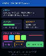

# ESP32-C6-Touch-AMOLED-1.8

A collection of ESP-IDF firmware projects for the **Waveshare ESP32-C6-Touch-AMOLED-1.8** development board.

Built with an **agentic-first development workflow** — each project is developed with [Claude Code](https://claude.ai/code) as the primary agent. Hardware specs, build rules, LVGL gotchas, and lessons learned across all projects live in `CLAUDE.md` and `.claude/commands/`, giving the agent full context from the first message of every session.

---

## Board

| Feature | Detail |
|---|---|
| Chip | ESP32-C6, RISC-V 160MHz, single-core |
| Flash | 16MB external NOR-Flash |
| Display | 1.8" AMOLED, SH8601, 368x448, QSPI 40MHz |
| Touch | Capacitive, FT3168, I2C |
| PMIC | AXP2101 (LiPo charge/discharge, power rails) |
| IMU | QMI8658 (6-axis accelerometer + gyroscope) |
| RTC | PCF85063 (with backup battery pads) |
| Audio | ES8311 codec + dual microphone array + speaker |
| IO Expander | TCA9554 (controls display/touch power) |
| Wireless | Wi-Fi 6, BT 5 LE, IEEE 802.15.4 (Thread / Zigbee / Matter) |
| Storage | microSD card slot (SDMMC) |
| Battery | 3.7V LiPo, MX1.25 connector, ~350mAh |

---

## Projects

| # | Project | Description |
|---|---|---|
| 11 | [MCP Canvas](projects/11_mcp_canvas/) | MCP server — AI draws to AMOLED over WiFi (12 tools, battery, power) |

### MCP Canvas Demo

An AI agent controls the 368x448 AMOLED display over WiFi using the [Model Context Protocol](https://modelcontextprotocol.io/). Widget-based rendering at full resolution — no framebuffer needed (display GRAM holds the pixels).

<p align="center">
  
</p>

**12 MCP tools:** `clear_canvas` `draw_rect` `draw_line` `draw_arc` `draw_text` `draw_path` `get_canvas_info` `get_canvas_snapshot` `get_battery_info` `set_brightness` `get_system_info` `power_off`

---

## Getting Started

### Prerequisites

- [ESP-IDF v5.5+](https://docs.espressif.com/projects/esp-idf/en/stable/esp32c6/get-started/)
- USB-C cable

### Build & Flash

```bash
# Activate ESP-IDF
. ~/esp/esp-idf/export.sh

# Build
idf.py -C projects/<name> build

# Flash
idf.py -C projects/<name> -p /dev/cu.usbmodem1101 flash
```

### New Project Setup

1. Copy the scaffold from an existing project or use `/new-project <name>` with Claude Code
2. Copy `sdkconfig.defaults.template` → `sdkconfig.defaults`, fill in WiFi credentials
3. Run `idf.py -C projects/<name> set-target esp32c6`
4. Build and flash

---

## Repository Structure

```
ESP32-C6-Touch-AMOLED-1.8/
├── shared/components/
│   └── amoled_driver/       # AMOLED display, touch, PMIC, LVGL driver
├── projects/
│   └── 11_mcp_canvas/       # MCP server with 12 drawing + device tools
├── ref/                     # Vendor reference code (gitignored)
├── docs/                    # Board research, reference documents
├── .claude/commands/        # Agent skills for Claude Code
├── CLAUDE.md                # Agent context: board specs, build rules, gotchas
└── README.md
```

## Critical Hardware Notes

1. **TCA9554 IO expander** (I2C 0x20) must set P4 and P5 HIGH before display/touch init
2. **SH8601 coordinates** must be even-aligned — LVGL needs a rounder callback
3. **No PSRAM** — display has built-in GRAM; use widget-based rendering, not framebuffer
4. **Nearly all GPIOs are used** by onboard peripherals — very few free pins for external hardware
5. **6 I2C devices** share one bus (GPIO 7/8): TCA9554, AXP2101, FT3168, QMI8658, PCF85063, ES8311
6. **AXP2101 PMIC** — long-press power button (2.5s) for hardware shutdown

---

## Board Research

Comprehensive research documents are included in the repo root:

| # | Document | Description |
|---|---|---|
| 01 | [Official Docs](01-official-docs.md) | Waveshare wiki, product page, specs, pinout, demos, pricing |
| 02 | [ESP32-C6 Chip Reference](02-esp32-c6-chip-reference.md) | Espressif datasheet, WiFi 6, BLE 5, Thread/Zigbee, C6 vs S3 |
| 03 | [Community Projects](03-community-projects-and-resources.md) | GitHub repos, articles, comparable boards |
| 04 | [Display & Touch Drivers](04-display-touch-drivers.md) | SH8601 QSPI, FT3168 I2C, library support matrix |
| 05 | [Development Setup Guide](05-development-setup-guide.md) | Arduino, PlatformIO, ESP-IDF, MicroPython, ESPHome, LVGL |
| 06 | [Comparison with LCD-1.47](06-comparison-with-lcd147-project.md) | Side-by-side with [esp32c6-lcd147-projects](https://github.com/chayuto/esp32c6-lcd147-projects) |
| 07 | [Complete GPIO & IO Map](07-complete-gpio-and-io-map.md) | Every GPIO assignment, pin_config.h, free pin analysis |
| 08 | [I2C Bus & Peripherals](08-i2c-bus-and-peripherals.md) | All 6 I2C devices, power architecture, init sequence |
| 10 | [RTC & Audio Peripherals](10-rtc-audio-peripherals.md) | PCF85063 RTC, ES8311 audio codec, XiaoZhi AI |
| 11 | [MCP Canvas Ref Architecture](11-mcp-canvas-reference-architecture.md) | LCD-1.47 MCP server + canvas drawing pipeline |
| 12 | [AMOLED MCP Canvas Strategy](12-amoled-mcp-canvas-strategy.md) | Canvas RAM strategy, option analysis, recommendation |
| 13 | [Implementation Plan](13-implementation-plan.md) | MCP canvas project architecture, module design, RAM budget |

## Key Links

- [Product Page](https://www.waveshare.com/esp32-c6-touch-amoled-1.8.htm)
- [Waveshare Docs Portal](https://docs.waveshare.com/ESP32-C6-Touch-AMOLED-1.8)
- [Official GitHub (Waveshare)](https://github.com/waveshareteam/ESP32-C6-Touch-AMOLED-1.8)
- [Schematic PDF](https://files.waveshare.com/wiki/ESP32-C6-Touch-AMOLED-1.8/ESP32-C6-Touch-AMOLED-1.8-Schematic.pdf)
- [ESP-IDF SH8601 Component](https://components.espressif.com/components/espressif/esp_lcd_sh8601)
- [ESP-IDF FT5x06 Touch Component](https://components.espressif.com/components/espressif/esp_lcd_touch_ft5x06)

## License

[MIT](LICENSE)
